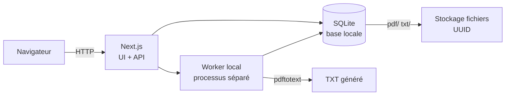

<div align="center">

# 📄 PDF → TXT

**Convertissez vos PDF en texte brut, en local, sans jamais les envoyer sur Internet.**

Application web mono-utilisateur qui dépose, convertit (via `pdftotext`) et archive
des centaines de PDF en TXT, avec file d'attente, reprise et statistiques — le tout
sur votre machine.


**100 % local · 0 service externe · 0 OCR · 0 compte**

</div>

---

## ✨ Fonctionnalités

| | |
|---|---|
| 🗂️ **Drag & drop + sélection multiple** | Jusqu'à **100 PDF** par ajout |
| ⚖️ **Limites maîtrisées** | **100 Mo** max par fichier, rejets expliqués |
| ⏩ **File d'attente persistante** | **4 conversions simultanées** (configurable) |
| 🔁 **Reprise robuste** | Redémarrage du serveur sans perte ni double traitement |
| 📥 **Téléchargement PDF / TXT** | Nom d'origine préservé (accents inclus) |
| 📋 **Copier le texte** | Presse-papiers en un clic |
| 🗑️ **Suppression définitive** | Avec confirmation, PDF + TXT + base |
| 🔄 **Relance** | Individuelle ou « relancer tous les échecs » |
| 📊 **Statistiques** | Terminés · en cours · en attente · échecs |

---

## 🛠️ Stack technique

Le projet met en œuvre une stack **TypeScript full-stack moderne**, pensé pour un usage
local robuste et sans friction :

- **[Next.js 14](https://nextjs.org/)** — App Router, Route Handlers (`app/api/*`) pour l'API REST, rendu serveur + React 18 côté client.
- **[TypeScript 5](https://www.typescriptlang.org/)** — typage strict de bout en bout (API, worker et interface partagent les mêmes types).
- **[React 18](https://reactjs.org/)** — interface orientée productivité (liste, upload, statistiques).
- **[better-sqlite3](https://github.com/WiseLibs/better-sqlite3/)** — base **SQLite** locale, performante et sans serveur (une seule table `files`, schéma conforme au cahier des charges).
- **[pdftotext](https://manpages.debian.org/stable/poppler-utils/pdftotext.1.en.html)** (Poppler) — extraction du texte **localement**, sans OCR ni API externe.
- **[busboy](https://github.com/mscdex/busboy)** — upload **streamé** multipart (pas de chargement en mémoire pour les fichiers de 100 Mo).
- **[Docker](https://www.docker.com/)** — image multi-étapes + `docker-compose` (serveur, worker et `pdftotext` dans un conteneur, données persistées en volume).

> **Choix de conception** : le cahier des charges envisageait Supabase local + PostgreSQL
> mais autorise une alternative si la complexité est disproportionnée. Pour une
> robustesse maximale et un fonctionnement **sans Docker ni serveur PostgreSQL**, le
> projet utilise **SQLite** + **stockage filesystem** (`data/pdf/<uuid>.pdf`,
> `data/txt/<uuid>.txt`). Le tout reste **100 % hors ligne**.

---

## 🏗️ Architecture

Le traitement est découplé de l'interface : un **worker séparé** poursuit les
conversions même si aucune page n'est ouverte.



- **Next.js** (`npm run dev` / `npm run build` + `npm run start`) — interface + API REST.
- **Worker** (`npm run worker`) — surveille la file `queued` et exécute `pdftotext`.

---

## 🚀 Démarrage rapide

### Prérequis

- **Node.js ≥ 18** (testé avec Node 20)
- **pdftotext** (poppler-utils) : `sudo apt install poppler-utils`

### Installation

```bash
npm install
```

### Lancement (2 terminaux)

```bash
# Terminal 1 — serveur web
npm run dev          # ou : npm run build && npm run start

# Terminal 2 — worker de conversion
npm run worker
```

Ouvrez **http://localhost:3000**.

### Scripts de gestion

```bash
./start.sh      # build + démarre serveur web et worker en arrière-plan
./stop.sh       # arrête proprement les deux processus
./restart.sh    # arrête puis redémarre
```

PIDs et journaux dans `.run/` (non versionné). Port : `PORT=3100 ./start.sh`.

---

## 🐳 Docker

Une seule commande pour tout lancer (serveur + worker + `pdftotext`) :

```bash
docker compose up -d --build     # http://localhost:3000
docker compose down              # arrêt (données conservées)
docker compose down -v           # arrêt + suppression des données
```

- `PORT=3100 docker compose up -d` — port personnalisé.
- `MAX_CONCURRENT_CONVERSIONS=8 docker compose up -d` — réglage de concurrence.
- Volume `pdf2txt-data` → `/app/data` : PDF, TXT et base persistés.
- `restart: unless-stopped` : relance automatique du conteneur ; le
  `docker-entrypoint.sh` relance aussi le worker s'il crashe.

---

## ⚙️ Configuration

Tout est optionnel (`cp .env.local.example .env.local`) et centralisé dans `lib/config.ts`.

| Variable | Défaut | Description |
|---|---|---|
| `DATA_DIR` | `./data` | Répertoire des données (PDF, TXT, base) |
| `MAX_CONCURRENT_CONVERSIONS` | `4` | Conversions simultanées |
| `PDFTOTEXT_PATH` | `pdftotext` | Chemin de l'exécutable |
| `PORT` | `3000` | Port du serveur |

Scripts utiles :

```bash
npm run db:init             # initialise la base + répertoires
npm run db:fix-filenames    # répare les noms de fichiers mojibake (accents)
```

---

## 🔌 API REST

| Méthode | Route | Description |
|---|---|---|
| `POST` | `/api/upload` | Upload streamé d'un PDF |
| `GET` | `/api/files` | Liste des fichiers (du plus récent au plus ancien) |
| `DELETE` | `/api/files?id=` | Suppression définitive |
| `GET` | `/api/download?id=&type=` | Téléchargement PDF / TXT |
| `GET` | `/api/text?id=` | Contenu TXT (copie presse-papiers) |
| `POST` | `/api/retry` | Relance individuelle (`{id}`) ou globale (`{all:true}`) |
| `POST` | `/api/cancel` | Annulation (`{id}`) |

---

## 🔁 Cycle de vie des fichiers

| Statut | Signification | Actions |
|---|---|---|
| `uploading` | Envoi vers le stockage | progression affichée |
| `queued` | Uploadé, en attente | Annuler |
| `processing` | Conversion `pdftotext` | Annuler |
| `completed` | TXT généré | Télécharger PDF/TXT · Copier · Supprimer |
| `failed` | Échec (raison affichée) | Relancer · Télécharger PDF · Supprimer |
| `cancelled` | Annulé par l'utilisateur | Relancer · Télécharger PDF · Supprimer |

**Reprise** : au démarrage, le worker remet les conversions laissées `processing`
(crash) en `queued` et les retraite. Un fichier `completed` n'est **jamais** retraité.

---

## 🗂️ Structure du projet

```
app/
  page.tsx                  Interface principale
  api/                      Route Handlers (upload, files, download, text, retry, cancel)
components/                 FileUploader, FileList, FileRow, Stats, ProgressBar
lib/
  config.ts                 Configuration centralisée
  db.ts                     Base SQLite + schéma
  types.ts · format.ts · api.ts · client-config.ts
worker/
  worker.ts                 Processus de conversion pdftotext
db/
  schema.sql                Schéma de référence
scripts/
  init-db.ts · fix-mojibake.ts
Dockerfile · docker-compose.yml · docker-entrypoint.sh
start.sh · stop.sh · restart.sh
```

---

## 🔒 Sécurité (application locale)

- Aucune commande shell construite depuis le nom de fichier utilisateur
  (`pdftotext` lancé avec des arguments séparés, jamais via un shell).
- Chemins physiques en **UUID**, jamais le nom utilisateur.
- Validation extension / MIME / taille, contenu devant commencer par `%PDF-`.
- Nom d'origine utilisé uniquement pour le téléchargement (`Content-Disposition`).
- Limites centralisées dans `lib/config.ts`.

---

<div align="center">

Fait avec ❤️ · 100 % local · Vos documents ne quittent jamais votre machine.

</div>

